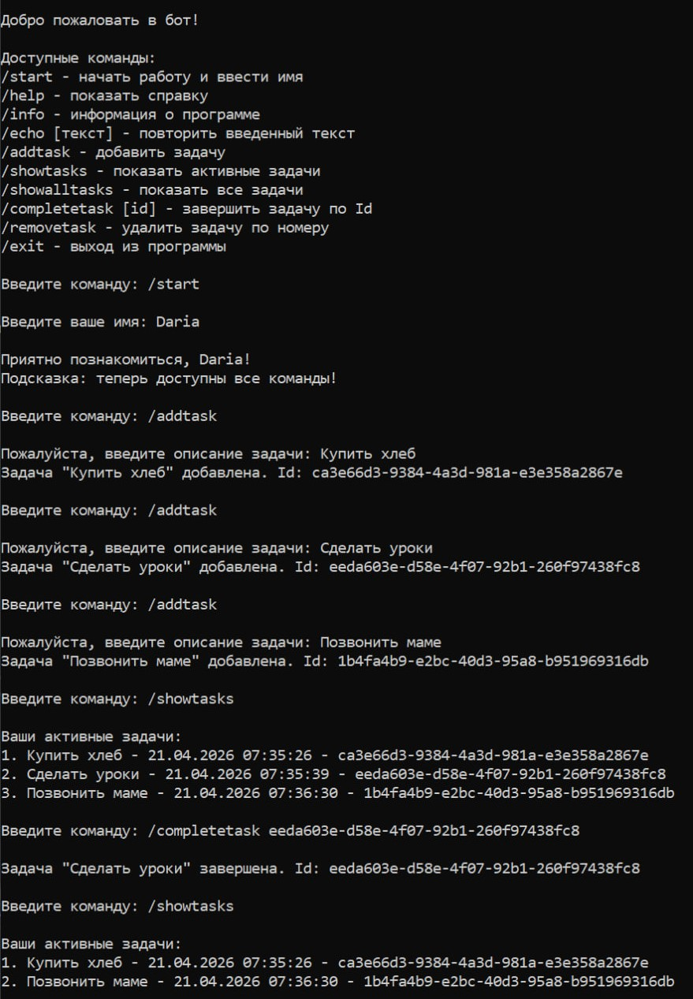
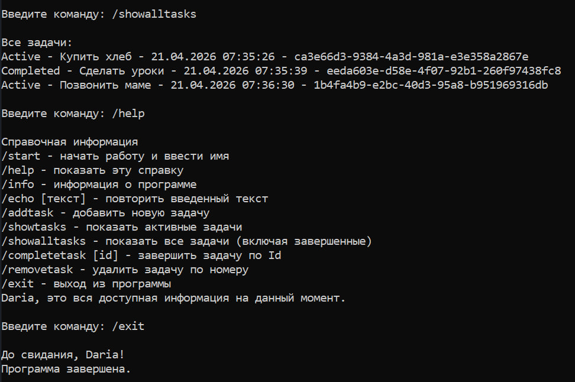

# 🤖 Консольный бот: ООП классы

## 📋 Описание проекта
Консольное приложение-бот с управлением списком задач.  
Разработано в рамках домашнего задания №4: добавлена работа с классами и новые команды для управления задачами.

## 🆕 Новые возможности (ДЗ №4)
- ✅ Класс `ToDoUser` — хранение информации о пользователе (UserId, TelegramUserName, RegisteredAt)
- ✅ Класс `ToDoItem` — хранение информации о задаче (Id, Name, CreatedAt, State)
- ✅ Enum `ToDoItemState` — состояния задачи (Active, Completed)

### Новые команды
- ✅ `/showtasks` — показывает только активные задачи (с Id и датой создания)
- ✅ `/showalltasks` — показывает все задачи (включая завершенные) с указанием State
- ✅ `/completetask [id]` — завершает задачу по указанному Id

## 🎮 Доступные команды

| Команда | Описание |
|---------|----------|
| `/start` | Начать работу и ввести имя |
| `/help` | Показать справочную информацию |
| `/info` | Информация о программе |
| `/echo [текст]` | Повторить введенный текст |
| `/addtask` | Добавить новую задачу |
| `/showtasks` | Показать только активные задачи |
| `/showalltasks` | Показать все задачи (включая завершенные) |
| `/completetask [id]` | Завершить задачу по Id |
| `/removetask` | Удалить задачу по номеру |
| `/exit` | Выход из программы |

## 📸 Демонстрация работы
| Добавление задач и просмотр активных | Просмотр всех задач и справка |
| --- | --- |
|  |  |

## ✅ Критерии выполнения
- Класс ToDoUser (конструктор, свойства)
- Класс ToDoItem + enum
- /showtasks (только активные + Id и CreatedAt)
- /completetask (поиск по Id, изменение State)
- /showalltasks (все задачи + вывод State)
- Обновленный /help

## 👤 Автор
Дорофеева Дарья  
Дата: 24.04.2026

## 📄 Лицензия
MIT License
